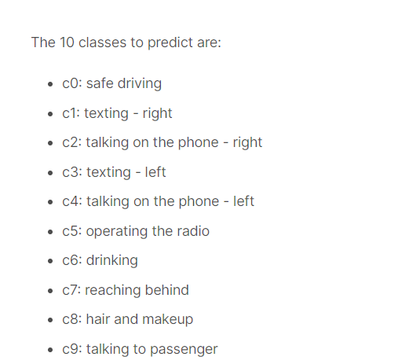
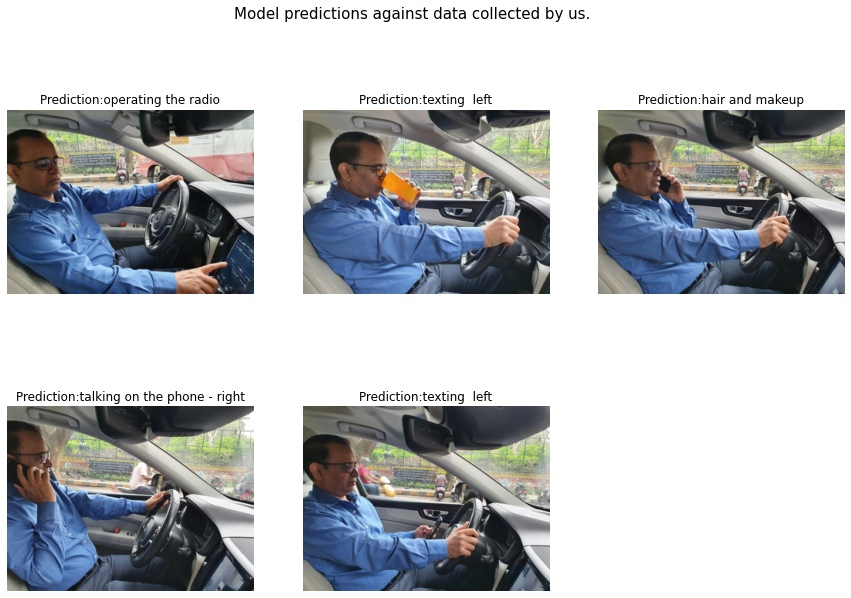

# Distracted-Driver-Detection-CNN

This repository contains work done as part of AI-2 course by [Univ.ai](https://www.univ.ai/).  
Our team ConvHeads - Himanshu, Chaitanya, Aayush, Samyak

## Project

Convolutional Neural Networks(CNNs) to detect whether the driver is attentive using in-car camera images.

Whether we are driving or in a passenger seat, we have seen drivers being distracted by a text on a phone, reaching behind for something, or having to attend a phone call. 

According to [U.S Department of Transportation](https://crashstats.nhtsa.dot.gov/Api/Public/ViewPublication/812926), Every day about 8 people in the United States are killed in crashes that are reported to involve a distracted driver.

We think that having a system that alerts the driver if they are distracted, is the need of the hour. We intend to do this using Convolutional Neural Networks and classify the drivers actions into 10 classes- safe driving, texting - right,talking on the phone - right, texting - left, talking on the phone - left, operating the radio, drinking, reaching behind, hair and makeup, talking to passenger.

## Data

The data was taken from the kaggle competition [State Farm Distracted Driver Detection](https://www.kaggle.com/competitions/state-farm-distracted-driver-detection/data).
The data set consisted of  driver images, each taken in a car with a driver doing something in the car (texting, eating, talking on the phone, makeup, reaching behind, etc).

## Methodology

<a href='Distracted-Driver-Detection.ipynb'>click here to view jupyter notebook</a>

## Results

The model predictions on real world images collected by us can be seen below.

<a href='presentation.pdf'>click here for presentation</a>

## Demo

We created a demo app using steamlit.  
**Switch on audio to enjoy Blissfull music** 

https://user-images.githubusercontent.com/68765011/205099433-ae70563f-f216-474b-bcd7-c26eb9720314.mp4

